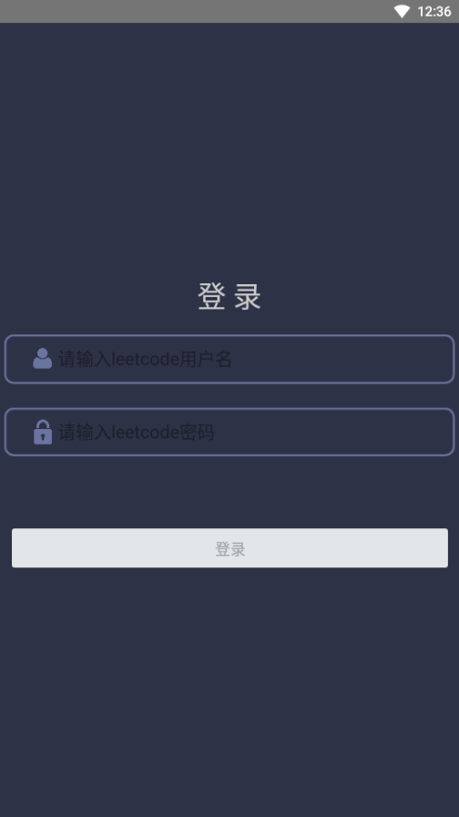
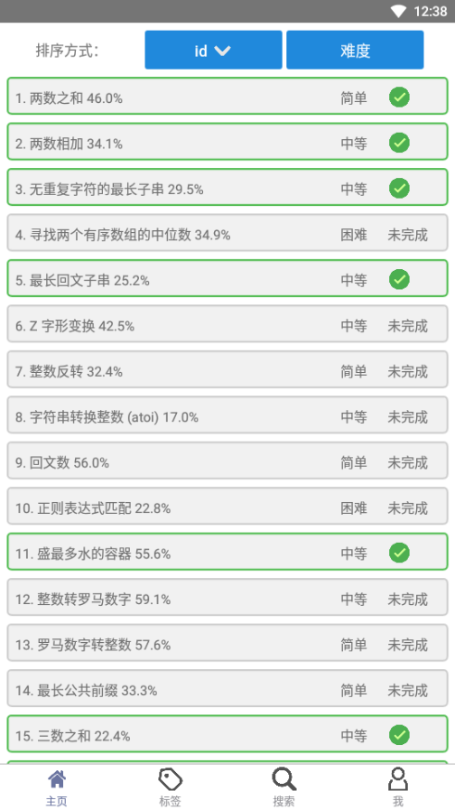
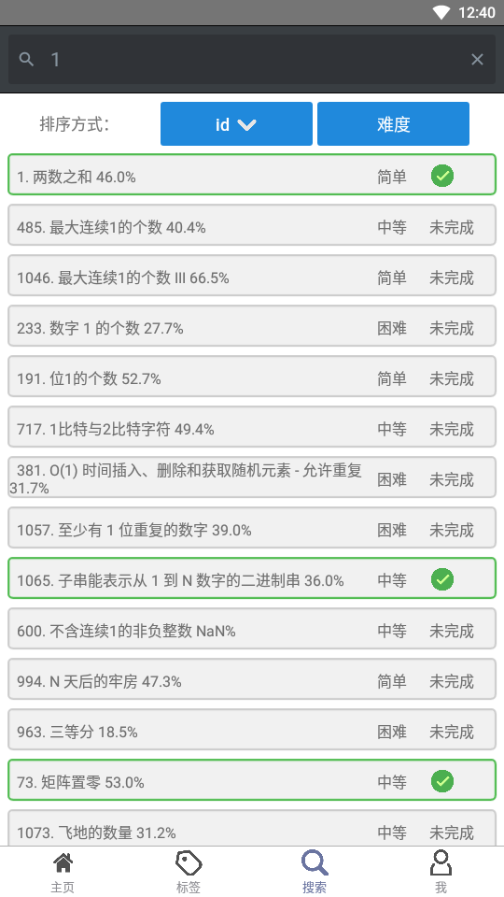
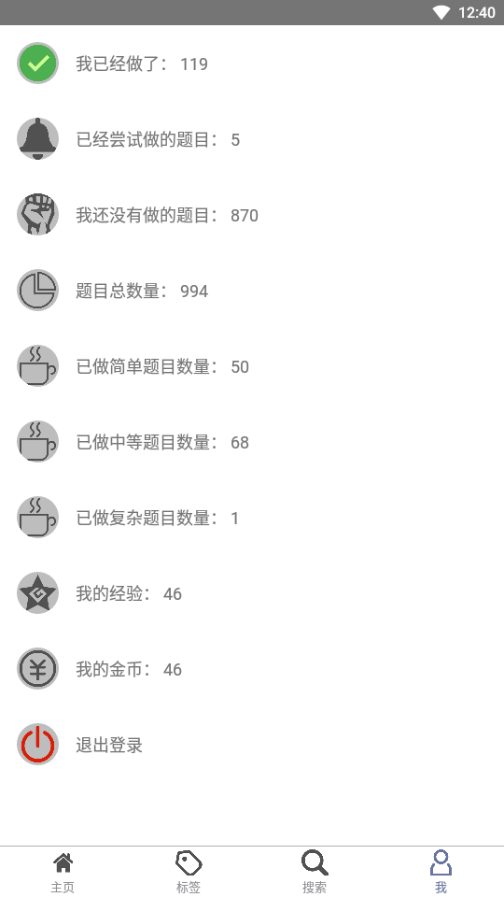

# leetcode-
自己制作的一个leetcode客户端，主要用于学习。

## 依赖
本项目基于react-native，请自行安装如下命令：

`node` `npm` `rnpm` `react-native` `adb` `java` 

## 项目启动方式

```$xslt
//请先连接安卓虚拟机

git@github.com:DarkblueTang/leetcode-android.git

cd leetcode-android.git

react-native run-android
```

## 项目打包方式
```$xslt
cd android

gradle assemble
```

## 效果展示

### 登录界面效果展示


### 加载题目界面展示


### 主页效果展示


### 标签页效果展示


### 搜索页效果展示


### 个人页面效果展示


